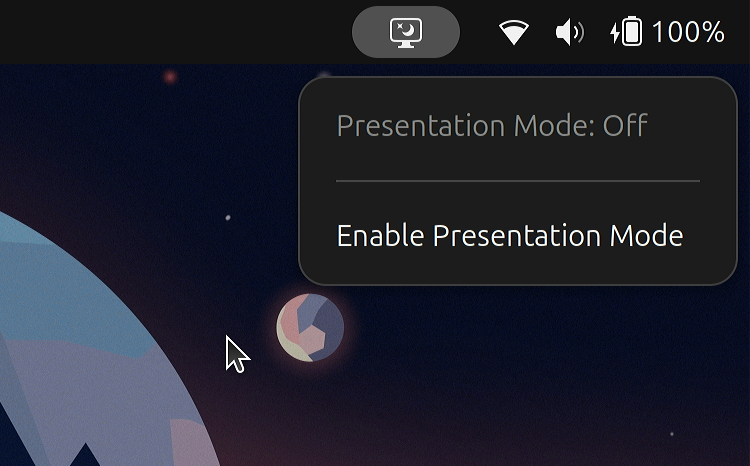

## About

GNOME Presentation Mode Panel is a GNOME Shell extension that adds a panel menu item which lets you inhibit the screensaver and lock screen in GNOME 47. It's a fork of Raphael Kimmig's [Gnome-Presentation-Mode](https://github.com/RaphaelKimmig/Gnome-Presentation-Mode).

## Installation instructions:

### GNOME Shell Extensions
Go to the [GNOME Shell Extensions](https://extensions.gnome.org/extension/8023/presentation-mode-panel/) page and install the extension.

### Manual installation
Clone this repository and copy the entire `pres-mode-panel@iKarTehFox` folder to the `~/.local/share/gnome-shell/extensions/` directory.

Use this handy command if you want:
`cp -r pres-mode-panel@iKarTehFox ~/.local/share/gnome-shell/extensions/`

## Licensing, etc

Copyright (C) 2025, Diego Perez (iKarTehFox)

Copyright (C) 2012, Jeremy Newton

Copyright (C) 2011, Raphael Kimmig

This program is free software; you can redistribute it and/or modify it under the terms of the GNU General Public License as published by the Free Software Foundation; either version 2 of the License, or (at your option) any later version.

This program is distributed in the hope that it will be useful, but WITHOUT ANY WARRANTY; without even the implied warranty of MERCHANTABILITY or FITNESS FOR A PARTICULAR PURPOSE. See the GNU General Public License for more details.

You should have received a copy of the GNU General Public License along with this program; if not, write to the Free Software Foundation, Inc., 51 Franklin St, Fifth Floor, Boston, MA 02110, USA 
